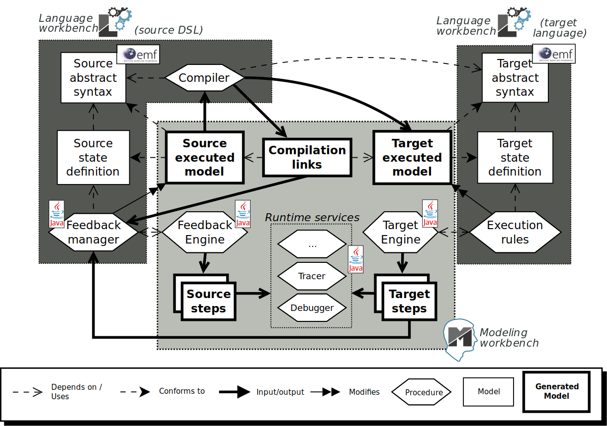
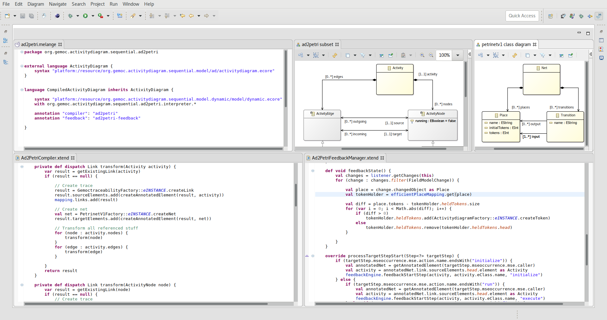
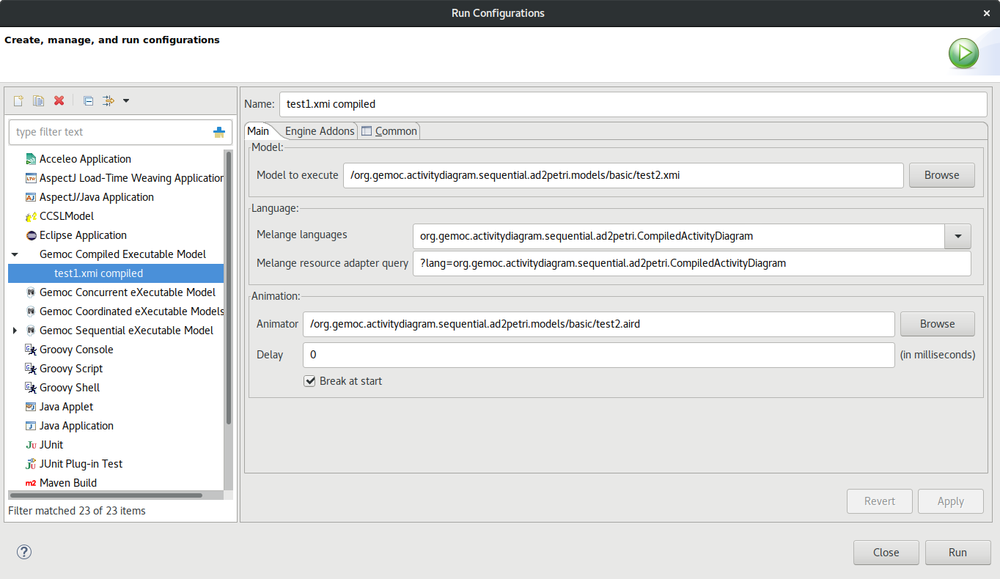
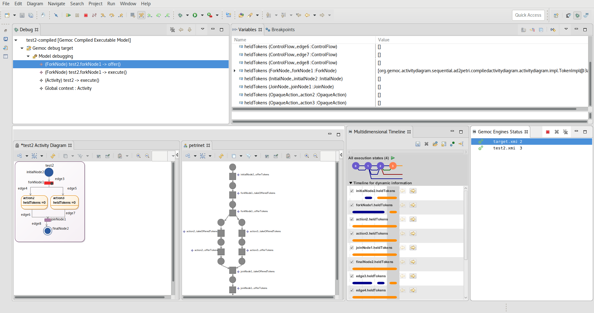

# GEMOC Studio extension for compiled DSLs

This repository contains a set of eclipse plugins to extend the [GEMOC Studio](http://gemoc.org/studio.html) with a new metaprogramming approach to define executable DSLs: the **compilation** to another executable language.

An example is also provided in the folder [`examples/ad2petri`](examples/ad2petri), with a small activity diagrams DSL that compiles to Petri nets.

## Installation

For now, no update site is provided for this extension. To install it, load the plugins (in the [`plugins`](plugins) folder) in the workspace of the latest GEMOC Studio, and start a new eclipse application from there.

## Usage

Summary of the architecture:

### Language definition

Given a chosen target executable language, also implemented using the GEMOC Studio Language Workbench, a compiled DSL is composed of:

- An **abstract syntax**, defined using Ecore, in a dedicated plugin and with code generated using a `genmodel` file.
- A **compiler**, which is a model transformation from the abstract syntax to the abstract syntax of the target language. It can be written with any language, as long as a Java class implementing the `org.gemoc.execution.feedbackengine.Compiler` interface is provided. In addition, this `Compiler` must be exposed using the `org.gemoc.execution.feedbackengine.compiler` extension point.
- A **definition of the state** of conforming executable models, by defining aspects using the [K3](http://diverse-project.github.io/k3/) language. These aspects must only contain dynamic data fields, and do not require operations.
- A **feedback manager**, which is a Java (or Java-compatible, eg. [Xtend](https://www.eclipse.org/xtend)) class implementing the `FeedbackManager` interface. It is responsible for translating target states and steps into source steps and states.
- A **feedback configuration**, which is a Java (or Java-compatible, eg. Xtend) class implementing the `FeedbackConfiguration` interface. It provides all the information required for feedback management: the feedback manager, the target language name and engine, the target configuration, This `FeedbackConfiguration` must be exposed using the `org.gemoc.execution.feedbackengine.feedback` extension point.
- A **language definition**, written using [Melange](http://melange.inria.fr/), which assemble all parts of the language. Specifically for compiled DSLs, two annotations (using the Melange `annotation` keyword) must be used: `compiler` and `compiler`, each pointing to the IDs of the extensions mentioned above.
- (optional) **A concrete syntax**, defined using [Sirius](https://www.eclipse.org/sirius), defining the graphical representation of both static and dynamic parts of the language.

Screenshot of an opened GEMOC Studio Language Workbench while implementing the [`ad2petri`](examples/ad2petri) example:

### Model execution and debugging

Once a compiled DSL has been deployed in the GEMOC Studio Modeling Workbench, a model conforming to the DSL can be executed very similarly to any other model in GEMOC.

1. Create a new launch configuration *GEMOC Compiled Executable Model*.
2. Choose a model conforming to the abstract syntax of the source DSLs.
3. Select the compiled DSL defined with Melange.
4. To have automatic animation of th executed model, add an animator, *ie.* a Sirius `.aird` file with a graphical representation of the model.
5. Start the execution, either in Run or in Debug. If in Debug mode, the debugger works similarly as for an interpreted DSL.

Screenshot of the launch configuration window to start execution a model from the [`ad2petri`](examples/ad2petri) example:

Screenshot of an opened GEMOC Studio Modeling Workbench while debugging a model from the [`ad2petri`](examples/ad2petri) example:

